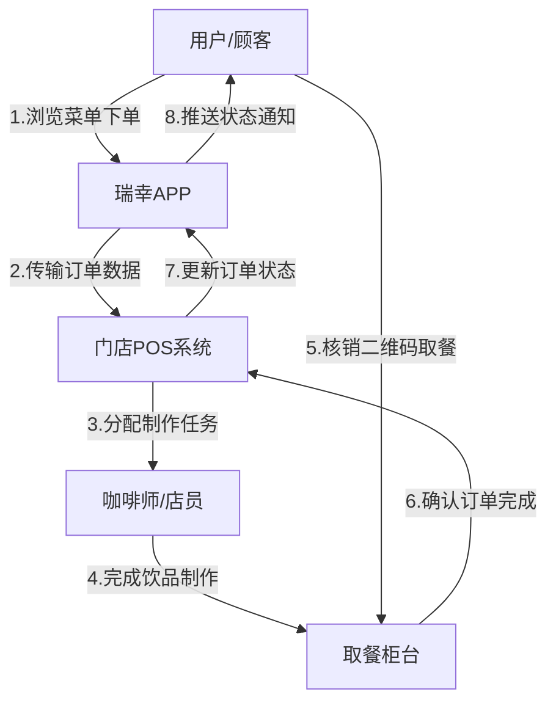
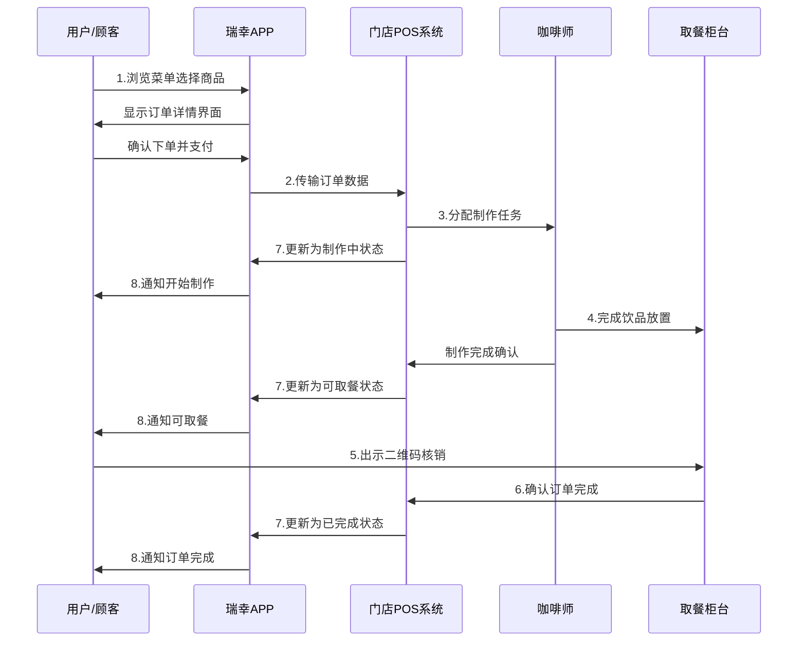

# 瑞幸咖啡纯业务协作关系可视化

## 📊 Graph 静态关系拓扑图

## ⏱️ Sequence 动态时序交互图

## 🔑 关键业务关系说明

### 核心业务协作关系（1-8）：
1. **用户→APP**：浏览菜单、选择商品、确认下单支付
2. **APP→门店POS**：将订单数据传输到指定门店POS系统
3. **门店POS→咖啡师**：分配饮品制作任务给咖啡师
4. **咖啡师→取餐柜台**：完成饮品制作并放置到取餐区
5. **用户→取餐柜台**：到店后出示二维码进行核销取餐
6. **取餐柜台→门店POS**：核销后确认订单完成状态
7. **门店POS→APP**：实时更新订单状态（接单、制作中、完成）
8. **APP→用户**：推送订单状态通知给用户

### 🎯 业务流程阶段：

#### 1. 下单阶段
- 用户通过APP完成商品选择和支付
- APP将订单数据传输到最近门店的POS系统

#### 2. 制作阶段  
- POS系统向咖啡师分配制作任务
- 咖啡师按订单要求制作饮品
- 系统实时更新订单状态并通知用户

#### 3. 取餐阶段
- 用户到店出示取餐二维码
- 取餐柜台核销二维码完成交付
- 系统确认订单最终完成状态

## 💡 业务协作特点

1. **闭环业务流程**：从下单到取餐的完整业务闭环
2. **实时状态同步**：订单状态在各环节间实时传递
3. **用户体验优化**：减少排队等待，提升取餐效率
4. **数字化核销**：二维码技术实现快速核销验证
5. **分布式协作**：多个业务角色协同完成订单处理

该可视化图表纯粹聚焦于瑞幸咖啡的业务操作流程，清晰展示了用户、APP、门店POS、咖啡师和取餐柜台之间的核心协作关系，体现了新零售模式下高效的业务运作方式。