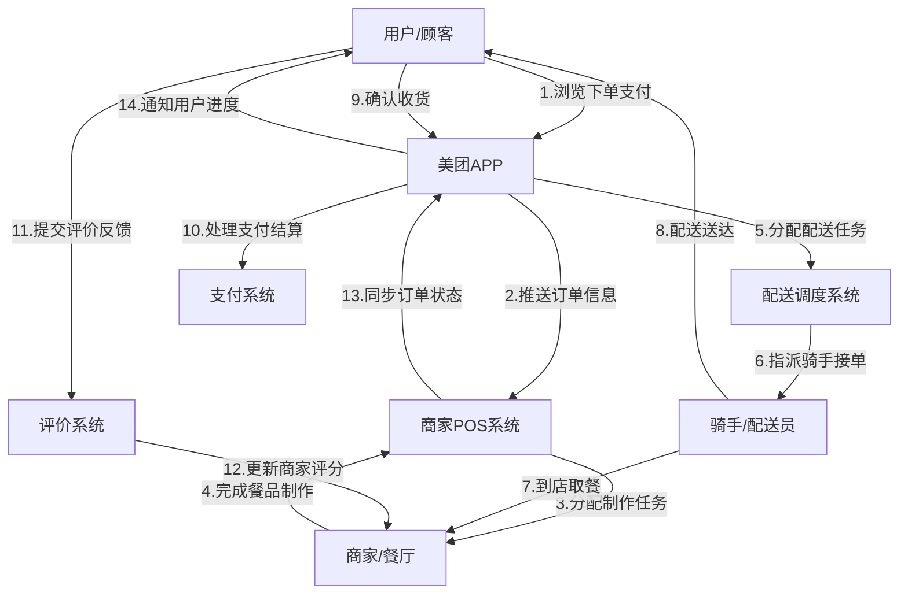
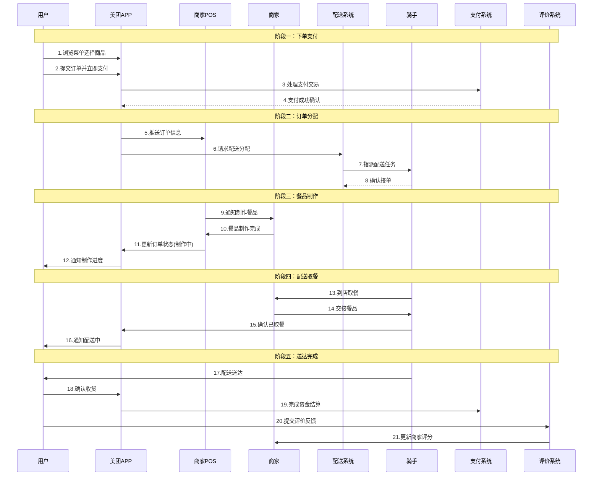

# 美团外卖业务流程可视化分析

## 1. 业务场景综述
美团外卖是一个连接用户、商家、骑手的三方平台业务，用户通过APP下单支付，商家接单制作餐品，骑手负责配送送达，平台协调整个流程并处理支付结算。

## 2. 关键实体描述
- **用户/顾客**: 下单支付、收货确认、评价反馈
- **美团APP**: 用户界面、订单管理、支付处理
- **商家/餐厅**: 接收订单、制作餐品、出餐准备
- **商家POS系统**: 订单接收、后厨指令、状态更新
- **骑手/配送员**: 接单取餐、配送运输、送达确认
- **配送调度系统**: 订单分配、路线规划、骑手管理
- **支付系统**: 交易处理、资金结算、退款管理
- **评价系统**: 反馈收集、评分统计、商家评级

## 3. 静态拓扑图

## 4. 时序图

## 5. 关键业务关系说明

### 核心协作关系
1. **用户-APP关系**: 下单支付、进度查看、收货确认
2. **APP-商家关系**: 订单推送、状态同步、结算处理
3. **商家-骑手关系**: 餐品交接、取餐确认
4. **骑手-用户关系**: 配送服务、送达确认
5. **平台协调关系**: 订单分配、状态管理、支付结算

### 主要数据流
- **订单数据流**: 用户→APP→商家→骑手→用户
- **支付数据流**: 用户→支付系统→商家结算
- **状态数据流**: 实时双向同步各环节状态
- **评价数据流**: 用户→评价系统→商家评级

## 6. 业务流程描述

### 正向业务流程
1. **下单阶段**: 用户浏览选择→提交订单→立即支付
2. **分配阶段**: APP推送订单→商家接单→系统分配骑手
3. **制作阶段**: 商家制作餐品→标记完成→状态更新
4. **配送阶段**: 骑手取餐→配送运输→送达用户
5. **完成阶段**: 用户确认→支付结算→评价反馈

### 业务特点
- **实时性要求高**: 各环节状态需要实时同步
- **三方协同**: 用户、商家、骑手三方高效协作
- **支付前置**: 下单时立即完成支付
- **状态驱动**: 订单状态驱动整个业务流程
- **闭环管理**: 从下单到评价的完整业务闭环