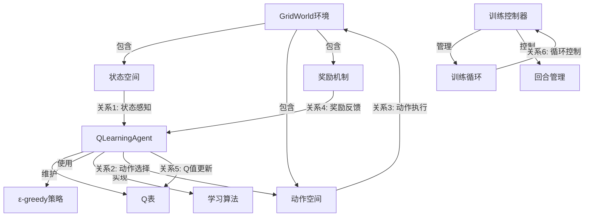
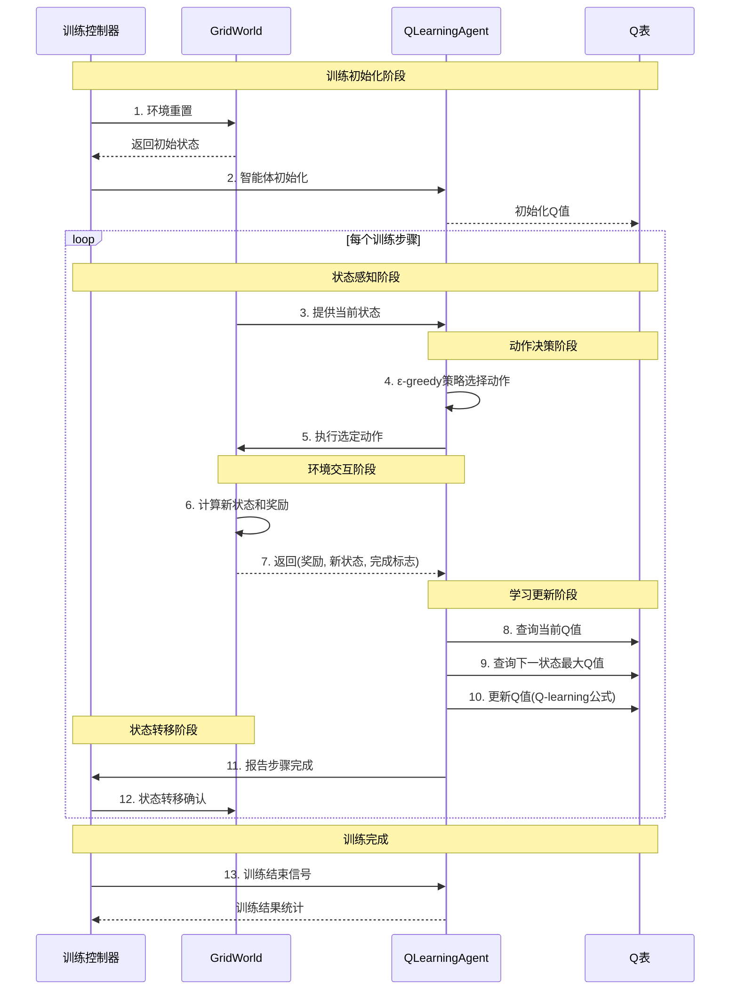

# Q-learning强化学习训练流程可视化分析

## 1. 业务场景综述

本分析针对Q-learning强化学习示例代码的训练阶段，重点展示网格世界环境中智能体与环境之间的协作关系。智能体通过ε-greedy策略探索环境，收集经验并更新Q表，最终学习到从起点到目标的最优路径。

## 2. 关键实体描述

### 核心训练实体
- **GridWorld环境**：4x4网格世界，包含起点(0,0)、目标(3,3)、障碍物(1,1)、(2,2)
- **QLearningAgent智能体**：实现Q-learning算法，包含Q表和ε-greedy策略
- **训练控制器**：管理训练循环和回合控制

### 数据存储实体
- **Q表**：存储状态-动作值的关键数据结构
- **经验缓冲区**：隐式的状态-动作-奖励-新状态元组

## 3. 静态拓扑图

## 4. 时序图

## 5. 关键业务关系说明

### 核心训练关系
1. **状态感知关系**：环境向智能体提供当前状态信息
2. **动作决策关系**：智能体基于ε-greedy策略选择动作
3. **环境执行关系**：智能体动作在环境中执行
4. **奖励反馈关系**：环境生成奖励信号反馈给智能体
5. **Q值更新关系**：智能体根据经验更新Q表值
6. **循环控制关系**：训练控制器管理训练流程

### 数据流特征
- **单向数据流**：状态→动作→环境→奖励→更新
- **实时性要求**：每个步骤需要完整的状态-动作-奖励循环
- **探索利用平衡**：ε-greedy策略平衡探索和利用

## 6. 流程流程描述

### 训练阶段流程
1. **初始化流程**：环境重置 + 智能体初始化 + Q表初始化
2. **感知决策流程**：状态获取 → 策略选择 → 动作执行
3. **环境交互流程**：动作执行 → 状态转移 → 奖励计算
4. **学习更新流程**：经验收集 → Q值查询 → 公式更新
5. **循环控制流程**：步骤计数 → 终止判断 → 下一回合

### 业务特点
- **迭代优化**：通过多次迭代逐步优化策略
- **经验回放**：隐式的经验收集和学习机制
- **收敛性**：随着训练进行，策略逐渐收敛到最优
- **泛化能力**：学习到的策略可以泛化到类似环境

### 性能指标
- **训练效率**：回合数和步数衡量学习速度
- **策略质量**：最终路径长度和总奖励
- **收敛速度**：Q值变化率和策略稳定性
- **探索效果**：环境覆盖率和障碍物避让能力