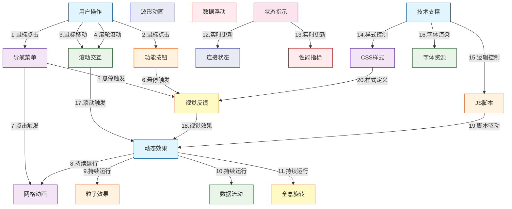
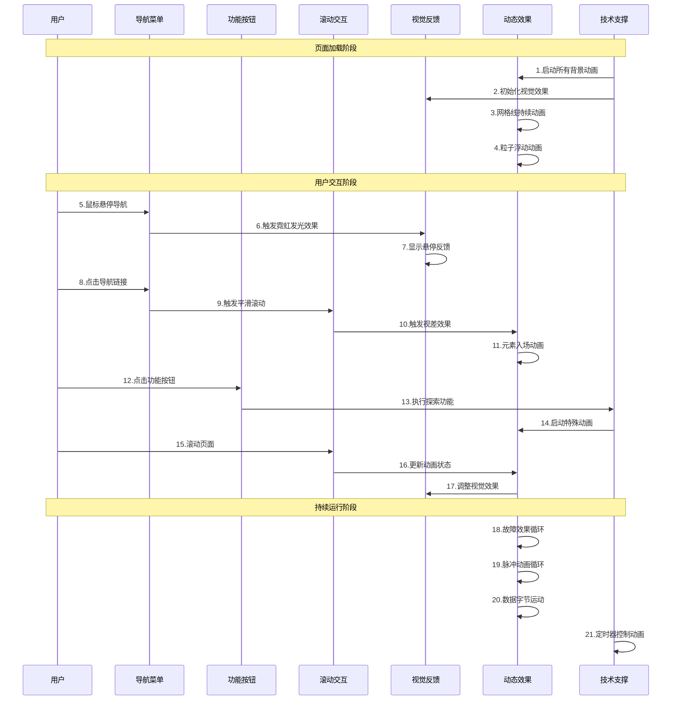

# 未来超现实RNB网页交互实体可视化分析

## 1. 业务场景综述
这是一个未来超现实风格的RNB音乐主题网页，专注于展示数字化音乐艺术的交互体验。网页采用全息背景、霓虹效果、故障艺术等未来科技元素，为用户提供沉浸式的数字音乐探索体验。

## 2. 关键交互实体描述
- **用户操作实体**: 导航菜单、功能按钮、滚动交互
- **视觉反馈实体**: 霓虹悬停效果、故障艺术效果、波形脉冲动画、数据字节浮动
- **动态效果实体**: 全息网格线、浮动粒子、数据流效果、磁盘全息效果
- **状态指示实体**: 连接状态显示、性能指标展示
- **技术支撑实体**: CSS样式系统、JavaScript脚本系统、外部字体资源

## 3. 静态拓扑图

## 4. 时序图

## 5. 关键交互关系说明

### 核心交互关系
1. **用户触发机制**: 鼠标操作（点击、悬停、移动、滚动）驱动整个交互系统
2. **视觉反馈链**: 用户操作 → 视觉变化 → 动态效果增强
3. **技术支撑层**: CSS控制视觉效果，JavaScript控制交互逻辑和复杂动画
4. **自动运行系统**: 背景动画和特效持续运行，不受用户操作影响

### 主要数据流
- **用户输入流**: 鼠标事件 → 交互处理 → 视觉响应
- **动画数据流**: 定时器 → 动画更新 → 渲染输出
- **状态数据流**: 系统状态 → 实时显示 → 用户感知

## 6. 交互流程描述

### 交互触发流程
1. **初始加载**: 所有背景动画自动启动，视觉效果初始化
2. **悬停交互**: 鼠标悬停触发霓虹发光效果，提供操作反馈
3. **点击交互**: 点击导航触发平滑滚动，点击按钮触发功能执行
4. **滚动交互**: 页面滚动触发视差效果和元素动画
5. **持续运行**: 故障艺术、脉冲动画、数据运动等效果循环运行

### 交互特点
- **多层次反馈**: 从简单的悬停效果到复杂的视差动画
- **实时响应**: 用户操作立即产生视觉变化
- **沉浸体验**: 持续运行的背景动画增强沉浸感
- **科技美感**: 故障艺术、数据流动等效果体现未来科技主题
- **性能优化**: 通过CSS动画和高效JavaScript实现流畅体验