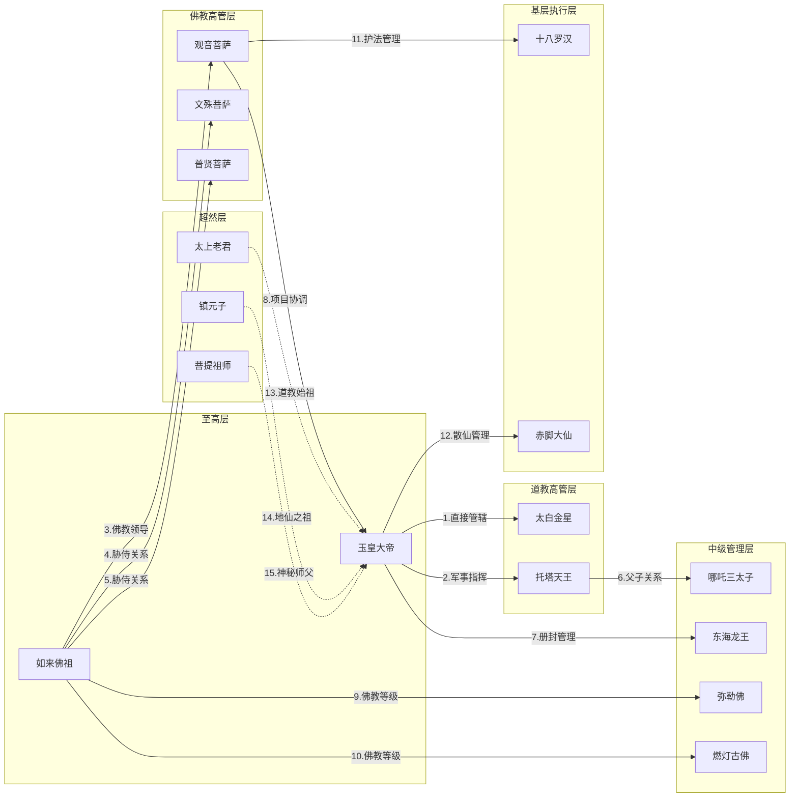
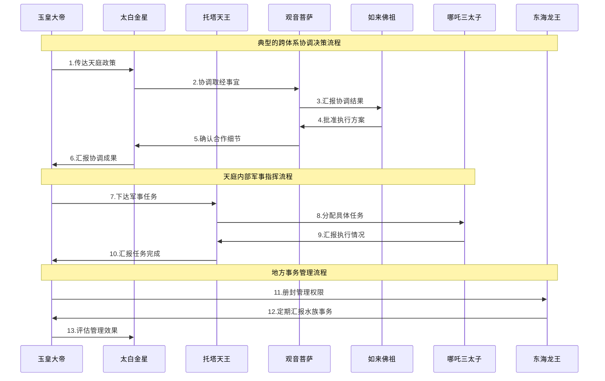

# 西游记神仙权力等级关系分析

## 1. 业务场景综述

本分析聚焦于《西游记》中神仙体系的权力等级制度和汇报关系。通过梳理道教天庭体系、佛教西天体系以及其他重要神仙势力之间的层级结构，展现中国古典神话中复杂的权力架构和管理体系。

### 核心目标
- 明确各神仙在权力体系中的等级地位
- 理清不同体系间的汇报和协作关系
- 分析跨体系协调机制和决策流程

## 2. 关键实体描述

### 道教体系（天庭）
- **玉皇大帝**: 天庭最高统治者，道教体系权力核心
- **太上老君**: 道教始祖，地位超然，不直接参与日常管理
- **太白金星**: 玉帝的首席顾问和外交使者
- **托塔天王(李靖)**: 天庭军事统帅，负责武装力量
- **哪吒三太子**: 托塔天王之子，天庭重要将领
- **赤脚大仙**: 散仙代表，在天庭有一定地位

### 佛教体系（西天）
- **如来佛祖**: 佛教最高领袖，西天权力核心
- **观音菩萨**: 佛教重要领袖，负责取经等重大项目
- **文殊菩萨**: 如来的胁侍菩萨，智慧象征
- **普贤菩萨**: 如来的胁侍菩萨，行愿象征
- **弥勒佛**: 未来佛，地位尊贵
- **燃灯古佛**: 过去佛，地位尊贵
- **十八罗汉**: 佛教护法，基层执行力量

### 其他重要势力
- **镇元子**: 地仙之祖，万寿山五庄观观主，地位超然
- **菩提祖师**: 孙悟空师父，身份神秘，实力深不可测
- **东海龙王**: 四海龙王之首，管理水族事务

## 3. 静态拓扑图

## 4. 时序图

## 5. 关键业务关系说明

1. **直接管辖关系**：玉皇大帝对太白金星的直接领导，体现天庭核心决策机制
2. **军事指挥关系**：玉皇大帝通过托塔天王管理天庭武装力量
3. **佛教领导关系**：如来佛祖对观音菩萨的宗教领导权
4. **胁侍关系**：文殊、普贤菩萨作为如来的左右胁侍
5. **胁侍关系**：同上，体现佛教内部等级制度
6. **父子关系**：托塔天王与哪吒的血缘和职务双重关系
7. **册封管理**：玉皇大帝对东海龙王的册封和管理权
8. **项目协调**：观音菩萨与玉皇大帝的跨体系协作关系
9. **佛教等级**：弥勒佛在佛教体系中的等级地位
10. **佛教等级**：燃灯古佛在佛教体系中的等级地位
11. **护法管理**：观音菩萨对十八罗汉的管理关系
12. **散仙管理**：玉皇大帝对散仙群体的松散管理
13. **道教始祖**：太上老君的超然地位，不直接参与管理但影响重大
14. **地仙之祖**：镇元子的独立地位，与天庭平等交往
15. **神秘师父**：菩提祖师的隐秘身份和超然实力

## 6. 业务流程描述

### 第一阶段：权力体系建立
- 玉皇大帝建立天庭统治体系
- 如来佛祖确立西天佛教权威
- 各体系内部等级制度形成

### 第二阶段：跨体系协调机制
- 通过太白金星等外交使者建立沟通渠道
- 观音菩萨承担跨体系项目协调职能
- 形成重大事务的协商决策机制

### 第三阶段：日常管理运作
- 各体系内部按等级进行日常管理
- 定期汇报和评估机制运行
- 处理各种突发事件和冲突

### 第四阶段：权力平衡维护
- 通过册封、协调等方式维护整体平衡
- 超然势力发挥制衡作用
- 确保各体系和谐共存

---

*分析完成时间：2025年1月*  
*西游记神仙权力等级关系分析 - 揭示古典神话中的权力架构*